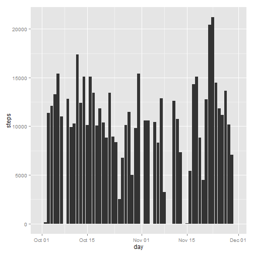
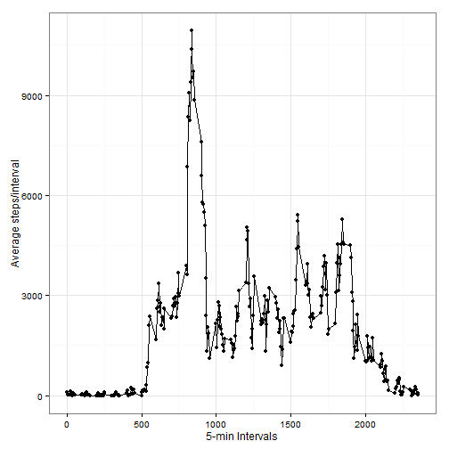
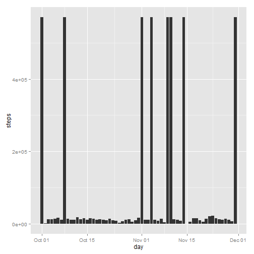
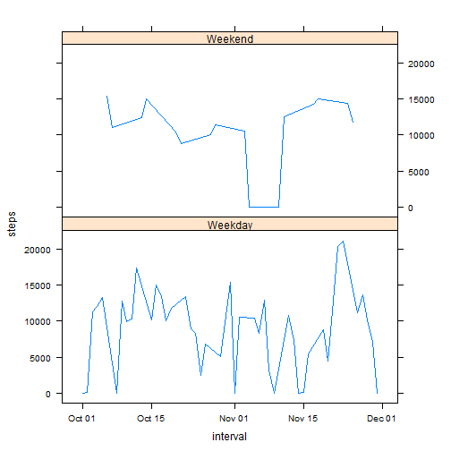

# Reproducible Research: Peer Assessment 1

# Personal Activity Monitorring Report 
This Knitted report is for the Reproducible Research class Homework Assignment #1. This report is an analysis of Peronal Activity
of the number of steps collected over five minute intervals from a single device/person over a two month period from October through
November of 2012.

## A) Loading and preprocessing the data
Please note that most all of the data processing used to genterate the figures is done in this section. This leaves just the generation of the figures for later in the code.

```r

# opts_chunk$set(echo = TRUE, results = 'show', cache = TRUE)

# Download the Activity data if it doesn't already exist
# setwd('C://Users//akeller.HARDEN//Documents//GitHub//RepData_PeerAssessment2')
internetSource <- "https://d396qusza40orc.cloudfront.net/repdata%2Fdata%2Factivity.zip"
fullzipfilename <- file.path(getwd(), "activity.zip")
fullfilename <- file.path(getwd(), "activity.csv")

## note: the following code has been commented out as is not working when
## Knitting, however, it can be used (uncommented) to run direct from the
## console in order to download the zip file from the internet if
## (!file.exists(fullzipfilename)){ #print('file not found locally, so
## dowload from website') download.file(internetSource ,
## destfile=fullzipfilename) }else{ #print('data previously downloaded and
## exists locally') }

# unzip contents to get single .csv file, but only if unzipped .csv file
# doesn't already exist assumes activity.zip is in Working Directory
if (!file.exists(fullfilename)) {
    unzip(fullzipfilename)
}

# load data into R
if (!exists("activity")) {
    activity <- read.csv(fullfilename, header = TRUE, colClasses = c("numeric", 
        "Date", "numeric"))
    # dataset <- read.csv(datasetPath, colClasses = c('numeric', 'Date',
    # 'numeric'))
} else {
    print("activity already loaded")
}

activityorig <- activity  #copy off original to later compare to newly copied object

# cut

# add a datimetime variable as a POSIXt class which combines date and
# hour/minutes from interval
activity$datetime <- strptime(paste(activity$date, activity$intervalmod), format = "%Y-%m-%d %H%M")

# sum values by Day and by Interval
byday <- tapply(activity$steps, activity$date, sum, na.rm = TRUE)
byday <- aggregate(activity$steps, list(activity$date), sum, na.rm = TRUE)
colnames(byday)[1] <- "day"
colnames(byday)[2] <- "steps"
# summary(byday)

davg <- mean(byday$steps, na.rm = TRUE)
dmed <- median(byday$steps, na.rm = TRUE)

# davg => 9354.23 dmed => 10395

byinterval <- tapply(activityorig$steps, activityorig$interval, sum, na.rm = TRUE)
byinterval <- aggregate(activityorig$steps, list(activityorig$interval), sum, 
    na.rm = TRUE)
colnames(byinterval)[1] <- "interval"
colnames(byinterval)[2] <- "steps"


# byinterval <- tapply(activity$steps,activity$intervalmod,sum, na.rm = TRUE
# ) byinterval <- aggregate(activity$steps,list(activity$intervalmod),
# sum,na.rm = TRUE ) merge byinterval with stepsmod to replace NULL values
# in stepsmod replaced with average steps for that timeinterval period
# rounded to the nearest whole numbers get interval means and put in a
# dataframe

# need to count number of missings. Used in output later
nMissingCount <- sum(is.na(activity$steps) | is.na(activity$date) | is.na(activity$interval))

# nMissingCount => 2304

# ak question. do I need leading zeros here or not? make intervalmod a
# factor variable
factor(activity$intervalmod)
```

```
## factor(0)
## Levels:
```

```r
# pad new intervalmod variable with leading zeros so that it is consistantly
# HHMM (military hrs)
activity$intervalmod <- sprintf("%04d", activity$interval)

byinterval$intervalmod <- byinterval$interval
factor(byinterval$intervalmod)
```

```
##   [1] 0    5    10   15   20   25   30   35   40   45   50   55   100  105 
##  [15] 110  115  120  125  130  135  140  145  150  155  200  205  210  215 
##  [29] 220  225  230  235  240  245  250  255  300  305  310  315  320  325 
##  [43] 330  335  340  345  350  355  400  405  410  415  420  425  430  435 
##  [57] 440  445  450  455  500  505  510  515  520  525  530  535  540  545 
##  [71] 550  555  600  605  610  615  620  625  630  635  640  645  650  655 
##  [85] 700  705  710  715  720  725  730  735  740  745  750  755  800  805 
##  [99] 810  815  820  825  830  835  840  845  850  855  900  905  910  915 
## [113] 920  925  930  935  940  945  950  955  1000 1005 1010 1015 1020 1025
## [127] 1030 1035 1040 1045 1050 1055 1100 1105 1110 1115 1120 1125 1130 1135
## [141] 1140 1145 1150 1155 1200 1205 1210 1215 1220 1225 1230 1235 1240 1245
## [155] 1250 1255 1300 1305 1310 1315 1320 1325 1330 1335 1340 1345 1350 1355
## [169] 1400 1405 1410 1415 1420 1425 1430 1435 1440 1445 1450 1455 1500 1505
## [183] 1510 1515 1520 1525 1530 1535 1540 1545 1550 1555 1600 1605 1610 1615
## [197] 1620 1625 1630 1635 1640 1645 1650 1655 1700 1705 1710 1715 1720 1725
## [211] 1730 1735 1740 1745 1750 1755 1800 1805 1810 1815 1820 1825 1830 1835
## [225] 1840 1845 1850 1855 1900 1905 1910 1915 1920 1925 1930 1935 1940 1945
## [239] 1950 1955 2000 2005 2010 2015 2020 2025 2030 2035 2040 2045 2050 2055
## [253] 2100 2105 2110 2115 2120 2125 2130 2135 2140 2145 2150 2155 2200 2205
## [267] 2210 2215 2220 2225 2230 2235 2240 2245 2250 2255 2300 2305 2310 2315
## [281] 2320 2325 2330 2335 2340 2345 2350 2355
## 288 Levels: 0 5 10 15 20 25 30 35 40 45 50 55 100 105 110 115 120 ... 2355
```

```r
byinterval$intervalmod <- sprintf("%04d", byinterval$intervalmod)

# put interval mean in stepsmod where values are NA in steps. otherwise use
# actual steps
activity$stepsmod <- ifelse(is.na(activity$steps), round(byinterval$steps[match(activity$intervalmod, 
    byinterval$intervalmod)], digits = 0), activity$steps)

activitynew <- activity[, c(6, 2, 3)]
colnames(activitynew)[1] <- "steps"  #rename stepsmod back to steps

# ak question: are the empty days overpopulating and should they be
# included?
bydaynew <- tapply(activitynew$steps, activitynew$date, sum, na.rm = TRUE)
bydaynew <- aggregate(activitynew$steps, list(activitynew$date), sum, na.rm = TRUE)
colnames(bydaynew)[1] <- "day"
colnames(bydaynew)[2] <- "steps"

# # make sure that if no steps are logged during a day that you don't impute
# any steps #the following is a cludgey way of fixing the matching 0 to more
# days # not clean but it does work. clean this up later bydaynew$steps <-
# ifelse( (bydaynew$steps == 570608) , 0 , bydaynew$steps )

# byday <- tapply(activity$steps, activity$date, sum)
davgnew <- mean(bydaynew$steps, na.rm = TRUE)
dmednew <- median(bydaynew$steps, na.rm = TRUE)


# davgnew => 84188.07 dmednew => 11458

# AverageDailySteps <- davg$steps activity$daytype <- ''
# factor(activity$daytype)
activity$daytype <- factor(ifelse(weekdays(activity[, "datetime"]) == "Saturday"  #if Saturday or Sunday
 | weekdays(activity[, "datetime"]) == "Sunday", 
    "Weekend"  #then Weekend
, "Weekday"))

```


## B) What is mean total number of steps taken per day?

For now, missing values are ignored in the dataset.
*(B1)*  Here is a histogram of the total number of steps taken each day

```r

# hist(byday$steps, breaks=61 , main = 'Total Number of Steps per Day' ,
# col='yellow' , xlab='Day' , ylab = 'Steps' , axes = TRUE , plot = TRUE)

library(ggplot2, quietly = TRUE, warn.conflicts = FALSE)
```

```
## Warning: package 'ggplot2' was built under R version 3.0.3
```

```r
ggplot(byday, aes(x = day, y = steps)) + geom_bar(stat = "identity")
```

 

```r

```


*(B2)*  The mean number of steps per day is 9,354
and the median number of steps per day is 10,395

For later...................................

## C) What is the average daily activity pattern?

*(C1)*  Time series plot (i.e.  type = "l" ) of the 5-minute interval (x-axis) and the average number of steps taken, averaged across all days (y-axis)

```r

library(ggplot2)
qplot(byinterval$interval, byinterval$steps, type = "l") + geom_line() + labs(x = "5-min Intervals", 
    y = "Average steps/interval") + theme_bw()
```

 

```r

# plot(davg, ylab='yyyy', xlab = 'xxxxx', main = 'mainnnn')
# ggplot(byinterval, aes(x = interval, y = steps)) + geom_line()
```


```r
max_interval <- byinterval[byinterval$steps == max(byinterval$steps), byinterval$interval]
```

```
## Error: undefined columns selected
```

```r
# max(byinterval$steps) => 10927
```


*(C2)*  The 5-minute interval, on average across all the days in the dataset, containing the maximum number of steps? is: 

```

Error in eval(expr, envir, enclos) : object 'max_interval' not found

```

.

 
## D. Imputing missing values

Note that there are a number of days/intervals where there are missing values (coded as  NA ). The presence of missing days introduces bias into some calculations or summaries of the data.

*(D1)*  The total number of missing values in the dataset (i.e. the total number of rows including NA s) is 2304

*(D2)*  

NA Replacement Stategy: I have replaced NA values with the mean of the matching tiem interval rounded to the nearest whole number. These values are placed in a newly created "stepsmod" variable combined with the originally provided  non-NA values.  

*(D3)*  Create a new dataset that is equal to the original dataset but with the missing data filled in.

The new dataset name is called activitynew.

Here are structures of the orignal and copied objects.


```r
# str(activity) #visualize that original object
str(activityorig)  #visualize that original object
```

```
## 'data.frame':	17568 obs. of  3 variables:
##  $ steps   : num  NA NA NA NA NA NA NA NA NA NA ...
##  $ date    : Date, format: "2012-10-01" "2012-10-01" ...
##  $ interval: num  0 5 10 15 20 25 30 35 40 45 ...
```

```r
str(activitynew)  #is the same as new object witout the NAs
```

```
## 'data.frame':	17568 obs. of  3 variables:
##  $ steps   : num  91 18 7 8 4 111 28 46 0 78 ...
##  $ date    : Date, format: "2012-10-01" "2012-10-01" ...
##  $ interval: num  0 5 10 15 20 25 30 35 40 45 ...
```


*(D4)*  Make a histogram of the total number of steps taken each day and Calculate and report the mean and median total number of steps taken per day. Do these values differ from the estimates from the first part of the assignment? What is the impact of imputing missing data on the estimates of the total daily number of steps?

The new mean number of steps per day is 84,188
and the new median number of steps per day is 11,458


```r

# hist(byday$steps, breaks=61 , main = 'Total Number of Steps per Day' ,
# col='green' , xlab='Day' , ylab = 'Steps' , axes = TRUE , plot = TRUE)

# ggplot(byday, aes(x = day, y = steps)) + geom_bar(stat = 'identity')
ggplot(bydaynew, aes(x = day, y = steps)) + geom_bar(stat = "identity")
```

 

```r

# hist(activitynew$steps , main='Total Number of Steps per Day with Missing
# Values Imputed' , xlab ='Total Steps per Day')

# byday <- tapply(activity$steps,activity$date,sum ) hist(bydaynew,
# breaks=61 , main = 'Total Number of Steps per Day (missing values
# imputed)' , col='green' , xlab='Day' , ylab = 'Average Steps' , axes =
# TRUE , plot = TRUE)
```


## E) Are there differences in activity patterns between weekdays and weekends?

For this part the  weekdays()  function may be of some help here. Use the dataset with the filled-in missing values for this part.
*(E1)*  Create a new factor variable in the dataset with two levels -- "weekday" and "weekend" indicating whether a given date is a weekday or weekend day.


*(E2)* Panel plot containing a time series plot (i.e.  type = "l" ) of the 5-minute interval (x-axis) and the average number of steps taken, averaged across all weekday days or weekend days (y-axis). The plot should look something like the following, which was creating using simulated data:

```r

# ggplot(byinterval, aes(x = interval, y = steps)) + geom_line() +
# facet_wrap(~daytype, nrow = 2)

library(plyr)
```

```
## Warning: package 'plyr' was built under R version 3.0.3
```

```r
# weekdaysList <- weekdays(activity$date) weekdaysList[!(weekdaysList %in%
# c('Saturday', 'Sunday'))] <- 'weekday' weekdaysList[(weekdaysList %in%
# c('Saturday', 'Sunday'))] <- 'weekend'

str(byday)
```

```
## 'data.frame':	61 obs. of  2 variables:
##  $ day  : Date, format: "2012-10-01" "2012-10-02" ...
##  $ steps: num  0 126 11352 12116 13294 ...
```

```r

byday$daytype <- factor(ifelse(weekdays(byday[, "day"]) == "Saturday"  #if Saturday or Sunday
 | weekdays(byday[, "day"]) == "Sunday", "Weekend"  #then Weekend
, "Weekday"))


datasetImputed$weekday <- as.factor(weekdaysList)
```

```
## Error: object 'weekdaysList' not found
```

```r
dailyStepsByWeekdayImputed <- ddply(datasetImputed, c("interval", "weekday"), 
    summarize, steps = mean(steps))
```

```
## Error: object 'datasetImputed' not found
```

```r

# xyplot(steps ~ interval | weekday, data = activity, layout = c(1, 2), type
# = 'l', xlab = 'Interval', ylab = 'Number of steps')

library(lattice)
```

```
## Warning: package 'lattice' was built under R version 3.0.3
```

```r

xyplot(steps ~ day | daytype, data = byday, layout = c(1, 2), type = "l", xlab = "interval", 
    ylab = "steps")
```

 

```r

```


***END****
